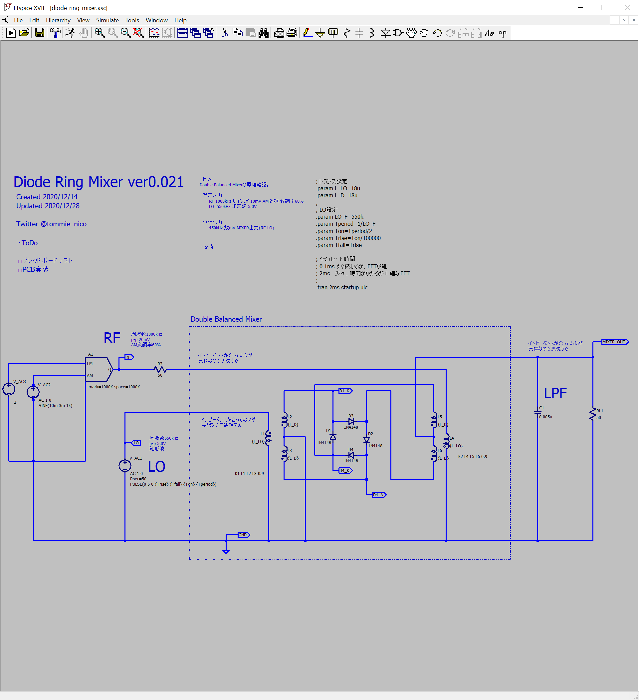
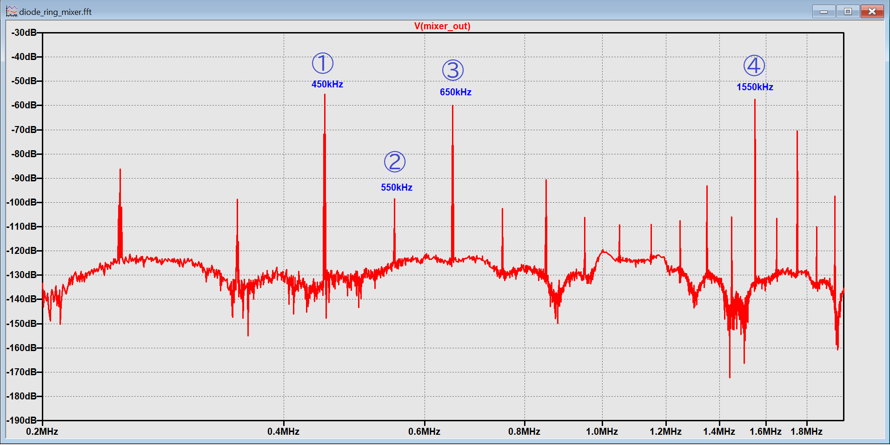
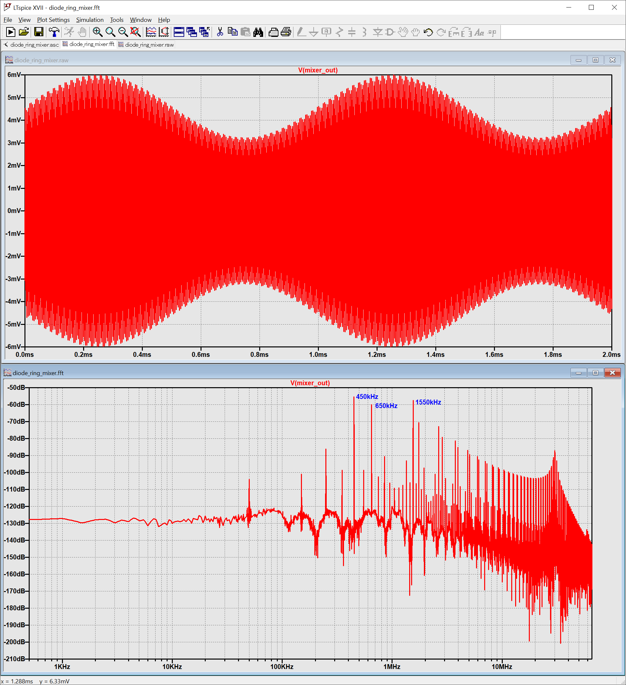

# Diode-Ring-Mixer

## Sammary (JPN: 概要)

JPN: LTspiceでダイオードリングミキサーをシミュレートする。

## Schematic (JPN: 回路図)

## Result FFT (JPN: 結果のFFT出力)

|No|Frequency| Description|
----|----|----
|① |450kHz| RF-LO|
|② |550kHz| LO|
|③ |650kHz| ?|
|- |1000kHz| RF|
|④ |1550kHz| RF+LO|

